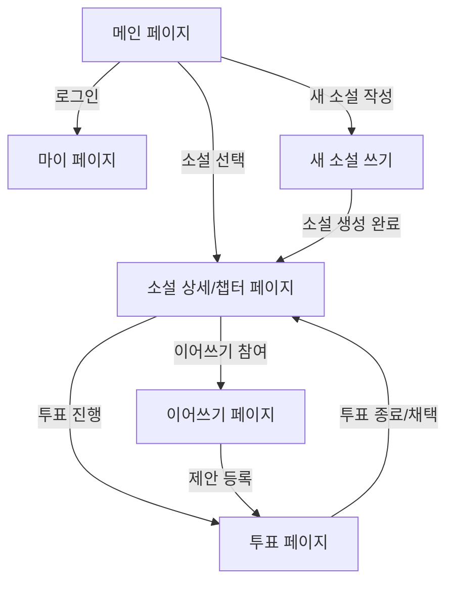

# Relai 플랫폼 - 프론트엔드 페이지 구성 가이드

본 문서는 Relai 플랫폼의 **프론트엔드 페이지 구조 및 역할**을 정의합니다.
각 페이지는 사용자 경험 흐름(UX Flow)에 맞추어 설계되었으며, **백엔드 API 연동 포인트**와 **UI/UX 목적**을 함께 설명합니다.

**작성자**: [왕택준](https://github.com/TJK98)

**문서 버전**: v1.0

**대상 독자:**

* **프론트엔드 개발자**: 페이지별 UI/UX 및 API 연동 기준 확인
* **백엔드 개발자**: 각 페이지에서 요구되는 API 스펙과 데이터 흐름 이해
* **QA/테스터**: 사용자 시나리오 기반 테스트 설계 참고
* **신규 합류자**: 전체 프론트엔드 페이지 구조 빠른 온보딩

---

## 1. 메인 페이지 (Main Page)

**목적:**

* 사용자 첫 진입점. 전체 소설 목록을 확인하고, 계정 관련 행동을 시작하는 허브.

**핵심 기능:**

* 소설 리스트 조회 (표지, 제목, 시놉시스 미리보기)
* 회원가입 및 로그인 모달 호출
* 새 소설 작성 버튼 제공

**연동 포인트:**

* [GET] `/api/novels` → 소설 목록 조회
* [POST] `/api/users/login`, `/api/users/register`

---

## 2. 마이 페이지 (My Page)

**목적:**

* 사용자 개인화 페이지. 참여 내역 및 프로필 관리.

**핵심 기능:**

* 회원 정보 수정 (닉네임, 비밀번호, 프로필 이미지 등)
* 내가 작성한 소설 목록 확인
* 내가 참여한 이어쓰기 작품 목록 확인

**연동 포인트:**

* [GET] `/api/users/{id}` → 회원 정보 조회
* [PUT] `/api/users/{id}` → 회원 정보 수정
* [GET] `/api/novels/mine`, `/api/proposals/mine`

---

## 3. 새 소설 쓰기 (Create Novel Page)

**목적:**

* 사용자가 직접 소설을 작성하거나, AI 보조를 통해 초안을 생성.

**핵심 기능:**

* 직접 입력: 제목, 시놉시스, 장르, 1화 내용 작성
* AI 보조 모드: 장르+시놉시스 입력 → AI 추천 제목/1화 내용 자동 생성

**연동 포인트:**

* [POST] `/api/novels` → 새 소설 생성
* [POST] `/api/ai/novel/recommend` → AI 보조 소설 초안 생성

---

## 4. 소설 리스트 페이지 (Novel Detail & Chapters)

**목적:**

* 특정 소설의 회차별 콘텐츠 열람 및 이어쓰기 안내 제공.

**핵심 기능:**

* 챕터 리스트 조회
* 본문 열람 모달
* 마지막 챕터 아래 이어쓰기 참여 안내

**연동 포인트:**

* [GET] `/api/novels/{id}`
* [GET] `/api/chapters/{novelId}`

---

## 5. 투표 페이지 (Voting Page)

**목적:**

* 이어쓰기 제안 확인 및 투표 진행.

**핵심 기능:**

* 특정 회차 기반 제안글 목록 조회
* 제안글 상세 모달 열람
* 이어쓰기 제안 작성 버튼
* 투표 버튼 + 남은 시간 표시

**연동 포인트:**

* [GET] `/api/proposals/{chapterId}` → 제안글 조회
* [POST] `/api/proposals` → 제안 등록
* [POST] `/api/votes` → 투표 진행

---

## 6. 이어쓰기 페이지 (Continue Writing Page)

**목적:**

* 기존 회차 기반으로 이어쓰기 작성. 직접 작성 또는 AI 보조 가능.

**핵심 기능:**

* 직접 작성: 제목 + 본문 입력
* AI 보조 모드: 사용자 요구사항 입력 → AI 이어쓰기 자동 생성

**연동 포인트:**

* [POST] `/api/proposals` → 새로운 제안(이어쓰기) 등록
* [POST] `/api/ai/proposals/continue` → AI 이어쓰기 생성

## 7. 전체 페이지 흐름 다이어그램

아래 다이어그램은 사용자가 플랫폼을 이용할 때 **페이지 전환 및 주요 액션 흐름**을 시각적으로 보여줍니다.

