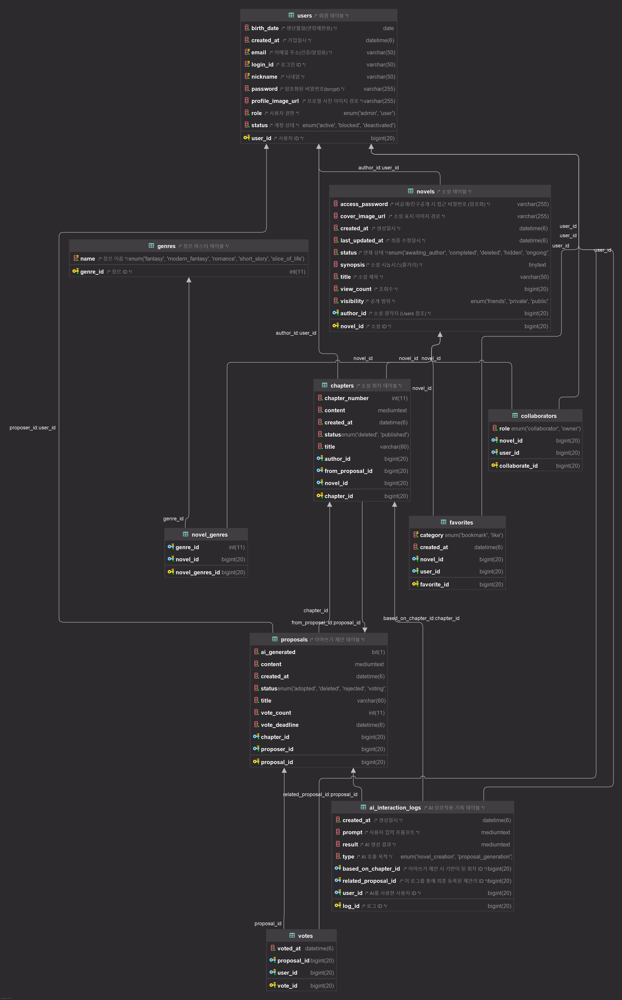

# 논리 ERD 명세서

**작성자:** [고동현](https://github.com/rhehdgus8831)

## 1. 개요

### 1.1. 문서 목적
본 문서는 독자 참여형 AI 웹소설 플랫폼의 데이터베이스 구조를 정의하는 **최종 논리적 ERD 명세서**입니다.

본 명세서는 프로젝트에 참여하는 **개발자, 데이터베이스 관리자(DBA), 기획자** 등 모든 구성원이 데이터 구조에 대해 일관된 이해를 갖는 것을 목표로 합니다.

### 1.2. 표기법 안내
-   **PK (Primary Key)**: 테이블의 각 레코드를 고유하게 식별하는 기본 키입니다.
-   **FK (Foreign Key)**: 다른 테이블의 PK를 참조하여 테이블 간의 관계를 설정하는 외래 키입니다.
-   **UNIQUE**: 해당 컬럼(또는 컬럼 조합)의 모든 값이 고유해야 함을 나타내는 제약 조건입니다.
-   **NOT NULL**: 해당 컬럼에 반드시 값이 존재해야 함을 의미합니다.

---

## 2. 테이블 명세

### 2.0. 논리 ERD

### 2.1. users
-   **설명**: 서비스 사용자의 정보를 저장하는 핵심 테이블입니다. 작가와 독자 모두를 포함하며, 모든 사용자 관련 데이터의 시작점입니다.
-   **비고**: `password`는  `Bcrypt` 알고리즘으로 해싱하여 저장합니다. `profile_image_url`에 기본값을 설정하여, 신규 가입 시 프로필 이미지가 없는 경우를 처리합니다.

| 컬럼명 | 데이터 타입 | 키 | 제약 조건 | 설명 |
|---|---|---|---|---|
| `user_id` | BIGINT | PK | NOT NULL, AUTO_INCREMENT | 사용자 고유 식별자 |
| `login_id` | VARCHAR(50) | | NOT NULL, UNIQUE | 로그인 시 사용하는 아이디 |
| `password` | VARCHAR(255) | | NOT NULL | 암호화된 비밀번호 (bcrypt) |
| `nickname` | VARCHAR(50) | | NOT NULL, UNIQUE | 서비스 내에서 표시되는 활동명 |
| `email` | VARCHAR(50) | | NOT NULL, UNIQUE | 이메일 주소 (인증/알림용) |
| `birth_date` | DATE | | NOT NULL | 생년월일 (연령 제한 콘텐츠 제공용) |
| `profile_image_url` | VARCHAR(255) | | | 프로필 사진 이미지 경로 (기본값: '/img/default-profile.webp') |
| `role` | ENUM('USER', 'ADMIN') | | NOT NULL, DEFAULT 'USER' | 사용자 권한 |
| `status` | ENUM('ACTIVE', 'BLOCKED', 'DEACTIVATED') | | NOT NULL, DEFAULT 'ACTIVE' | 계정 상태 |
| `created_at` | DATETIME | | NOT NULL, DEFAULT CURRENT_TIMESTAMP | 가입일시 |

### 2.2. novels
-   **설명**: 사용자가 연재하는 웹소설의 메타 데이터를 저장하는 테이블입니다.
-   **비고**: `last_updated_at`은 새 챕터 발행 등 주요 변경 시마다 갱신되어야 합니다.

| 컬럼명 | 데이터 타입 | 키 | 제약 조건 | 설명 |
|---|---|---|---|---|
| `novel_id` | BIGINT | PK | NOT NULL, AUTO_INCREMENT | 소설 고유 식별자 |
| `author_id` | BIGINT | FK | NOT NULL | 소설 원작자 ID (users.user_id) |
| `title` | VARCHAR(50) | | NOT NULL | 소설 제목 |
| `synopsis` | TEXT | | | 소설 시놉시스 (줄거리) |
| `cover_image_url` | VARCHAR(255) | | | 소설 표지 이미지 경로 |
| `visibility` | ENUM('PUBLIC', 'PRIVATE', 'FRIENDS') | | NOT NULL | 공개 범위 |
| `access_password` | VARCHAR(255) | | | 비공개/친구공개 시 접근 비밀번호 (암호화) |
| `status` | ENUM('ONGOING', 'AWAITING_AUTHOR', 'COMPLETED', 'HIDDEN', 'DELETED') | | NOT NULL | 연재 상태 |
| `view_count` | BIGINT | | NOT NULL, DEFAULT 0 | 조회수 |
| `created_at` | DATETIME | | NOT NULL, DEFAULT CURRENT_TIMESTAMP | 생성일시 |
| `last_updated_at` | DATETIME | | NOT NULL | 최종 수정일시 |

### 2.3. chapters
-   **설명**: 각 소설에 포함된 개별 회차(챕터)의 정보를 저장합니다.
-   **비고**: `content` 컬럼은 긴 본문을 저장하기 위해 `MEDIUMTEXT`로 명시적으로 지정되었습니다. `from_proposal_id`는 해당 회차가 독자의 제안을 통해 만들어졌음을 나타내는 중요한 연결고리입니다.

| 컬럼명 | 데이터 타입 | 키 | 제약 조건 | 설명 |
|---|---|---|---|---|
| `chapter_id` | BIGINT | PK | NOT NULL, AUTO_INCREMENT | 회차 고유 식별자 |
| `novel_id` | BIGINT | FK | NOT NULL | 이 회차가 속한 소설 ID (novels.novel_id) |
| `author_id` | BIGINT | FK | NOT NULL | 해당 회차 작성자 ID (users.user_id) |
| `from_proposal_id` | BIGINT | FK | UNIQUE | 이 회차의 원본이 된 제안 ID (proposals.proposal_id) |
| `chapter_number` | INT | | NOT NULL | 회차 번호 (소설 내 순서) |
| `title` | VARCHAR(60) | | NOT NULL | 회차 제목 |
| `content` | MEDIUMTEXT | | NOT NULL | 회차 본문 내용 |
| `status` | ENUM('PUBLISHED', 'DELETED') | | NOT NULL | 회차 상태 |
| `created_at` | DATETIME | | NOT NULL, DEFAULT CURRENT_TIMESTAMP | 생성일시 |

### 2.4. proposals
-   **설명**: 독자들이 다음 회차의 내용을 제안하는 '이어쓰기 제안' 데이터를 저장하는 테이블입니다.
-   **비고**: `vote_deadline`은 제안 생성 시 `created_at`을 기준으로 자동 계산됩니다(예: 생성 후 3일). `ai_generated` 플래그를 통해 AI 생성 제안과 사용자 직접 작성 제안을 구분할 수 있습니다.

| 컬럼명 | 데이터 타입 | 키 | 제약 조건 | 설명 |
|---|---|---|---|---|
| `proposal_id` | BIGINT | PK | NOT NULL, AUTO_INCREMENT | 제안 고유 식별자 |
| `chapter_id` | BIGINT | FK | NOT NULL | 제안의 대상이 되는 회차 ID (chapters.chapter_id) |
| `proposer_id` | BIGINT | FK | NOT NULL | 제안자 ID (users.user_id) |
| `title` | VARCHAR(60) | | NOT NULL | 제안 제목 |
| `content` | MEDIUMTEXT | | NOT NULL | 제안 본문 내용 |
| `vote_deadline` | DATETIME | | NOT NULL | 투표 마감일시 |
| `vote_count` | INT | | NOT NULL, DEFAULT 0 | 받은 투표 수 |
| `status` | ENUM('VOTING', 'ADOPTED', 'REJECTED', 'DELETED') | | NOT NULL | 제안 상태 |
| `ai_generated` | BOOLEAN | | NOT NULL, DEFAULT FALSE | AI 생성 여부 |
| `created_at` | DATETIME | | NOT NULL, DEFAULT CURRENT_TIMESTAMP | 생성일시 |

### 2.5. genres
-   **설명**: 작품에 사용될 장르의 종류를 관리하는 마스터 데이터 테이블입니다.
-   **비고**: `name` 컬럼은 코드 레벨에서 `GenreType` Enum으로 관리되어 데이터의 정합성과 타입 안정성을 보장합니다.

| 컬럼명 | 데이터 타입 | 키 | 제약 조건 | 설명 |
|---|---|---|---|---|
| `genre_id` | INT | PK | NOT NULL, AUTO_INCREMENT | 장르 고유 식별자 |
| `name` | VARCHAR(50) | | NOT NULL, UNIQUE | 장르 이름 (Enum 상수명) |

### 2.6. novel_genres
-   **설명**: 소설과 장르 간의 다대다(N:M) 관계를 연결하는 매핑 테이블입니다.
-   **비고**: `(novel_id, genre_id)` 조합에 UNIQUE 제약조건을 설정하여, 하나의 소설에 동일한 장르가 중복으로 연결되는 것을 원천적으로 방지합니다.

| 컬럼명 | 데이터 타입 | 키 | 제약 조건 | 설명 |
|---|---|---|---|---|
| `novel_genres_id` | BIGINT | PK | NOT NULL, AUTO_INCREMENT | 관계 고유 식별자 |
| `novel_id` | BIGINT | FK | NOT NULL | 소설 ID (novels.novel_id) |
| `genre_id` | INT | FK | NOT NULL | 장르 ID (genres.genre_id) |

### 2.7. collaborators
-   **설명**: 한 소설에 여러 작가가 참여할 경우, 협업 관계와 역할을 정의하는 테이블입니다.
-   **비고**: `(novel_id, user_id)` 조합에 UNIQUE 제약조건이 필요합니다.

| 컬럼명 | 데이터 타입 | 키 | 제약 조건 | 설명 |
|---|---|---|---|---|
| `collaborate_id` | BIGINT | PK | NOT NULL, AUTO_INCREMENT | 협업 관계 고유 식별자 |
| `novel_id` | BIGINT | FK | NOT NULL | 소설 ID (novels.novel_id) |
| `user_id` | BIGINT | FK | NOT NULL | 협업 참여자 ID (users.user_id) |
| `role` | ENUM('OWNER', 'COLLABORATOR') | | NOT NULL | 협업 역할 |

### 2.8. favorites
-   **설명**: 사용자가 작품에 대해 '좋아요'를 누르거나 '책갈피'로 저장한 정보를 관리합니다.
-   **비고**: `(user_id, novel_id, category)` 조합에 UNIQUE 제약조건을 설정하여, 한 사용자가 같은 소설에 동일한 카테고리(예: '좋아요')를 중복 등록할 수 없도록 합니다.

| 컬럼명 | 데이터 타입 | 키 | 제약 조건 | 설명 |
|---|---|---|---|---|
| `favorite_id` | BIGINT | PK | NOT NULL, AUTO_INCREMENT | 즐겨찾기 고유 식별자 |
| `user_id` | BIGINT | FK | NOT NULL | 사용자 ID (users.user_id) |
| `novel_id` | BIGINT | FK | NOT NULL | 소설 ID (novels.novel_id) |
| `category` | ENUM('BOOKMARK', 'LIKE') | | NOT NULL | 구분 (책갈피, 좋아요) |
| `created_at` | DATETIME | | NOT NULL, DEFAULT CURRENT_TIMESTAMP | 생성일시 |

### 2.9. votes
-   **설명**: 사용자가 특정 제안(`proposals`)에 투표한 기록을 저장합니다.
-   **비고**: `(user_id, proposal_id)` 조합에 UNIQUE 제약조건을 **반드시 설정**하여 중복 투표를 방지합니다.

| 컬럼명 | 데이터 타입 | 키 | 제약 조건 | 설명 |
|---|---|---|---|---|
| `vote_id` | BIGINT | PK | NOT NULL, AUTO_INCREMENT | 투표 기록 고유 식별자 |
| `user_id` | BIGINT | FK | NOT NULL | 투표자 ID (users.user_id) |
| `proposal_id` | BIGINT | FK | NOT NULL | 투표 대상 제안 ID (proposals.proposal_id) |
| `voted_at` | DATETIME | | NOT NULL, DEFAULT CURRENT_TIMESTAMP | 투표일시 |

### 2.10. ai_interaction_logs
-   **설명**: 사용자와 AI 모델 간의 모든 상호작용(프롬프트, 결과)을 기록하는 로그 테이블입니다.
-   **비고**: 서비스 사용 패턴 분석, 비용 추적, AI 모델 개선 등 다용도로 활용될 중요한 데이터입니다. `prompt`와 `result`는 매우 긴 텍스트를 저장할 수 있도록 `MEDIUMTEXT`로 설정되었습니다.

| 컬럼명 | 데이터 타입 | 키 | 제약 조건 | 설명 |
|---|---|---|---|---|
| `log_id` | BIGINT | PK | NOT NULL, AUTO_INCREMENT | 로그 고유 식별자 |
| `user_id` | BIGINT | FK | NOT NULL | AI를 사용한 사용자 ID (users.user_id) |
| `based_on_chapter_id` | BIGINT | FK | | 이어쓰기 제안 시 기반이 된 회차 ID (chapters.chapter_id) |
| `related_proposal_id` | BIGINT | FK | UNIQUE | 이 로그를 통해 최종 등록된 제안 ID (proposals.proposal_id) |
| `type` | ENUM('NOVEL_CREATION', 'PROPOSAL_GENERATION') | | NOT NULL | AI 호출 목적 |
| `prompt` | MEDIUMTEXT | | | 사용자 입력 프롬프트 |
| `result` | MEDIUMTEXT | | | AI 생성 결과 |
| `created_at` | DATETIME | | NOT NULL, DEFAULT CURRENT_TIMESTAMP | 생성일시 |
