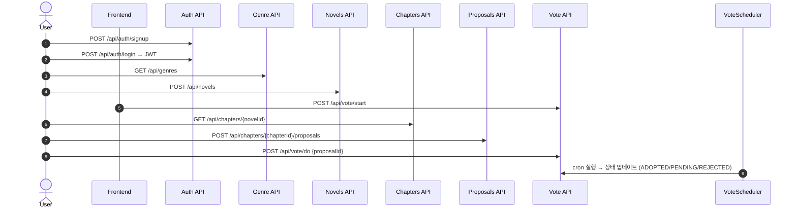
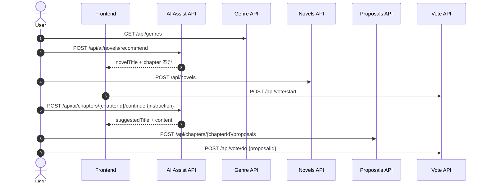

# Relai 플랫폼 API & 시퀀스 다이어그램 문서

본 문서는 Relai 플랫폼의 **전체 사용자 시나리오 흐름**을

- **Mermaid 시퀀스 다이어그램**
- **OpenAPI 3.0 (Swagger) API 스펙**

두 가지 형식으로 제공합니다.

**작성자**: [왕택준](https://github.com/TJK98)

**문서 버전**: v1.0

**대상 독자:**
- **프론트엔드 개발자 (FE)**: API 요청/응답 구조 및 시퀀스 흐름 확인
- **백엔드 개발자 (BE)**: 엔드포인트 정의, 상태 전이, 스케줄러 연계 파악
- **QA/테스터**: 시퀀스 기반 테스트 케이스 설계
- **운영자**: 서비스 흐름 및 주요 API 계약 이해

---

## 1. Mermaid 시퀀스 다이어그램

### A. 수동 흐름

---

### B. AI 보조 흐름

